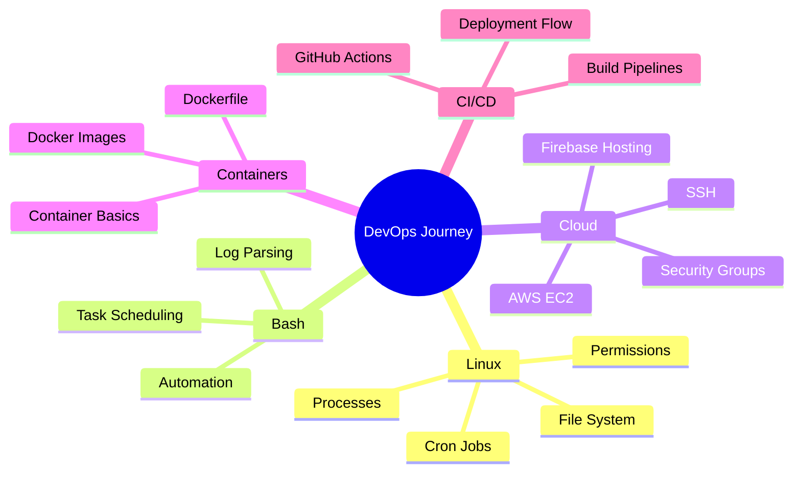

<!--
  GitHub Profile README for Diyan Ehsan Syed
  Tip: Rename this file to README.md and place it inside a repository with the same name as your GitHub username.
-->

 

  

---

##  About Me

I am **Diyan Ehsan Syed**, a **Computer Science student from Islamabad, Pakistan**, focused on building practical software with a strong interest in **Flutter mobile development, cloud-backed applications, automation, and DevOps**.

I started by building real-world mobile apps using **Flutter, Firebase, REST APIs, and responsive UI design**. Alongside app development, I am growing my DevOps foundation through **Linux system administration, Bash scripting, AWS EC2, Docker basics, GitHub Actions, and CI/CD concepts**.

I enjoy creating projects that are not only functional, but also clean, scalable, and easy to maintain.

 

---

## 🚀 What I Do

<table>
<tr>
<td width="50%">

### 📱 Mobile App Development
- Flutter UI development
- Firebase Authentication
- Firestore & Realtime Database
- REST API integration
- Responsive layouts
- App animations
- Role-based app flows

</td>
<td width="50%">

### ⚙️ DevOps & Cloud Learning
- Linux CLI & system basics
- Bash scripting
- Git & GitHub workflows
- AWS EC2 basics
- SSH & security groups
- Docker fundamentals
- CI/CD with GitHub Actions

</td>
</tr>
</table>

---

## 🧰 Tech Stack

### Languages

### Frameworks, Tools & Platforms

### Currently Exploring

---

## 🌟 Featured Projects

<table>
<tr>
<td width="50%">

### 🚐 VANTREK  
**Cloud-Backed Student Ride Application**

A multi-role Android app for **students, drivers, and admins**, designed with real-time coordination and cloud-backed infrastructure.

**Highlights**
- Firebase Authentication
- Firestore database with multiple collections
- Real-time GPS tracking flow
- Admin panel and route management
- Driver status monitoring
- Explored AWS EC2 for backend hosting

**Tech:** `Flutter` `Firebase` `Firestore` `AWS EC2`

</td>
<td width="50%">

### 📚 StudyBuddy App  
**Assignment & Quiz Management App**

An educational app that helps **teachers and students** manage assignments and quizzes with authentication and real-time database operations.

**Highlights**
- Login and signup system
- CRUD operations
- Firebase Firestore integration
- Realtime Database usage
- Student-teacher workflow

**Tech:** `Flutter` `Firebase` `Firestore`

</td>
</tr>

<tr>
<td width="50%">

### 🌦️ Weather Monitor  
**API-Based Weather Application**

A responsive Flutter app that fetches and displays weather data for any area using a REST API.

**Highlights**
- REST API integration
- Responsive UI layouts
- Smooth app animations
- Location-based weather monitoring

**Tech:** `Flutter` `REST API` `Dart`

</td>
<td width="50%">

### 🧠 Face Detection Attendance System  
**Python Automation Project**

A Linux-based automation project that processes video frames and logs attendance without manual entry.

**Highlights**
- Python scripting
- OpenCV-based processing
- Attendance automation
- Linux debugging and dependency setup

**Tech:** `Python` `OpenCV` `Linux`

</td>
</tr>

<tr>
<td width="50%">

### 🔢 Digit Recognizer  
**Machine Learning Pipeline**

An end-to-end machine learning workflow from preprocessing to training and inference.

**Highlights**
- Data preprocessing
- Model training
- CLI-based workflow
- Virtual environment management

**Tech:** `Python` `TensorFlow` `CLI`

</td>
<td width="50%">

### ⚙️ DevOps Practice Lab  
**Linux, Bash, Docker & CI/CD Learning**

A growing practice space for DevOps fundamentals, automation scripts, and deployment workflows.

**Focus Areas**
- Linux file permissions
- Process management
- Bash automation
- Docker images and containers
- GitHub Actions basics

**Tech:** `Linux` `Bash` `Docker` `GitHub Actions`

</td>
</tr>
</table>

---

## 📊 GitHub Analytics

  

---

## 🐍 Contribution Snake

> To make the snake animation work, create a GitHub Actions workflow in your profile repository that generates the snake SVG.

---

## 🎯 Current Learning Roadmap

---

## 🏆 Strengths

| 💡 Strength | ⚡ How I Apply It |
|---|---|
| Fast Learner | Learned Flutter and Firebase from scratch and built real-world apps |
| Systems Thinker | Designed multi-role flows, Firestore structures, and cloud-backed app logic |
| Detail-Oriented | Maintained clean project structure, Git workflows, and documented architecture |
| Growth Mindset | Actively learning Linux, Bash, Docker, CI/CD, and cloud deployment |

---

## 🤝 Let’s Connect

  

  

